# SpendConscience: Autonomous iOS Budgeting Agent

*An AI-powered financial coach that prevents overspending before it happens*

## 🚀 Project Overview

SpendConscience is a revolutionary iOS application that acts as an autonomous financial coach, helping users stay within their budgets through intelligent interventions and proactive spending guidance. Unlike traditional budgeting apps that simply track expenses after the fact, SpendConscience takes preventive action by analyzing spending patterns, calendar events, and financial goals to intervene before overspending occurs.

## 💡 Idea Exploration

### The Problem
Traditional budgeting apps are **reactive** - they tell you what you've already spent, often after it's too late to make meaningful changes. Users receive notifications about budget overruns days or weeks after the damage is done, creating a cycle of financial stress and poor decision-making.

### Our Solution
SpendConscience is **proactive** - it acts as an intelligent financial guardian that:
- Analyzes your upcoming calendar events to predict spending
- Warns you before you make purchases that could break your budget
- Suggests cheaper alternatives in real-time using location data
- Creates personalized financial coaching messages
- Blocks calendar events automatically when budgets are at risk

### Core Innovation
**True Local-First AI**: All financial data processing happens on-device with zero cloud storage, ensuring complete privacy while leveraging AI for intelligent decision-making.

## 🎯 Use Cases

### Primary Use Cases

#### 1. **Proactive Budget Warning**
```
Scenario: User approaches 80% of dining budget mid-month
Action: "Hold up! You're at 85% of your dining budget with 12 days left. 
        Consider cooking at home tonight?"
Options: Acknowledge, adjust budget, or set stricter limits
```

#### 2. **Event-Based Spending Intervention**
```
Scenario: Expensive calendar event detected (dinner reservation, concert)
Action: "I see you have dinner at Le Bernardin tomorrow ($200 estimated). 
        This would put you 15% over your dining budget."
Options: Proceed, suggest alternatives, or reschedule
```

#### 3. **Real-Time Purchase Decision Support**
```
Scenario: User asks "Can I afford this $50 dinner?"
Action: AI analyzes current spending, upcoming events, and budget status
Response: "✅ Yes! This represents only 4% of your available funds and 
          keeps you within your dining budget."
```

#### 4. **Voice-Activated Financial Assistant**
```
Scenario: "Hey Siri, how's my budget?"
Response: "You're doing great! You're on track in 5/6 categories. 
          Watch your entertainment spending - you're at 90% with a week left."
```

### Advanced Use Cases

#### 5. **Calendar-Aware Budget Planning**
- Automatically estimates costs for calendar events (dinners, concerts, travel)
- Warns about budget impact before events occur
- Suggests budget adjustments based on upcoming commitments

#### 6. **Location-Based Spending Alternatives**
- Detects when you're near expensive restaurants
- Suggests cheaper alternatives within walking distance
- Provides real-time affordability assessments

#### 7. **Behavioral Pattern Recognition**
- Learns your spending habits and timing
- Identifies risky spending patterns (weekend splurges, stress spending)
- Provides personalized coaching based on your behavior

## 🏗️ Architecture

### High-Level System Architecture


### Data Flow Architecture

```mermaid
sequenceDiagram
    participant U as User
    participant iOS as iOS App
    participant DM as Data Manager
    participant API as API Service
    participant MCP as MCP Servers
    participant Plaid as Plaid API
    participant AI as AI Agents
    
    U->>iOS: "Can I afford $50 dinner?"
    iOS->>DM: Request current budget status
    DM->>Plaid: Fetch latest transactions
    Plaid-->>DM: Transaction data
    DM->>API: Send query with context
    API->>MCP: Process financial question
    MCP->>AI: Analyze spending patterns
    AI-->>MCP: Generate recommendation
    MCP-->>API: Structured response
    API-->>iOS: AI recommendation
    iOS-->>U: "✅ Yes, you can afford it!"
```



## 🛠️ Tech Stack

### iOS Application
| Component | Technology | Purpose |
|-----------|------------|---------|
| **Platform** | Native iOS 18.5+ | Required for deep system integration |
| **UI Framework** | SwiftUI | Modern declarative UI development |
| **Database** | SwiftData + SQLite | Local data persistence with relationships |
| **Networking** | URLSession | Secure API communications |
| **Authentication** | iCloud Keychain | Secure credential storage & sync |
| **AI Processing** | Local LLM (planned) | Privacy-preserving AI inference |
| **Banking** | Plaid Link SDK | Secure bank account integration |
| **Calendar** | EventKit | System calendar integration |
| **Location** | Core Location | Restaurant alternatives |
| **Notifications** | UserNotifications | Budget alerts and reminders |
| **Voice** | SiriKit | Voice command integration |

### Backend Services
| Component | Technology | Purpose |
|-----------|------------|---------|
| **Framework** | Inkeep Agent Framework | Multi-agent AI orchestration |
| **Runtime** | Node.js 22+ | Server-side JavaScript execution |
| **API Server** | Express.js | RESTful API endpoints |
| **AI Integration** | Anthropic/OpenAI APIs | Large language model access |
| **Banking API** | Plaid API | Financial data integration |
| **Maps** | Google Maps API | Location-based services |
| **Protocol** | MCP (Model Context Protocol) | Agent communication standard |
| **Package Manager** | pnpm | Efficient dependency management |
| **Build System** | Turbo.js | Monorepo build orchestration |

### Development Tools
| Tool | Purpose |
|------|---------|
| **Xcode 16.4+** | iOS development environment |
| **Inkeep CLI** | Agent graph management |
| **Biome** | Code formatting and linting |
| **TypeScript** | Type-safe JavaScript development |

## ✨ Features

### Core Features

#### 🤖 **AI-Powered Financial Coach**
- Multi-agent system with specialized roles (Budget Analyzer, Affordability Agent, Financial Coach)
- Personalized coaching messages with tone adjustment (playful/serious)
- Context-aware recommendations based on spending patterns
- Template-based fallback system for offline operation

#### 💳 **Smart Budget Management**
- Real-time budget tracking across multiple categories
- Dynamic budget status indicators (Safe/Warning/Danger)
- Automatic spending categorization with manual override
- Monthly budget reset and rollover options

#### 📅 **Calendar-Aware Spending**
- Automatic cost estimation for calendar events
- Proactive budget impact analysis for upcoming events
- Integration with iOS Calendar for event management
- Smart reminder creation for budget-conscious decisions

#### 🏦 **Secure Banking Integration**
- Direct Plaid API integration with certificate pinning
- Multi-account support with real-time balance tracking
- Incremental transaction sync with conflict resolution
- Sandbox environment for development and testing

#### 📍 **Location-Based Alternatives**
- Real-time restaurant alternative suggestions
- Price-filtered recommendations based on budget constraints
- Walking distance calculations for convenience
- Privacy-protected location services

#### 🔔 **Intelligent Notifications**
- Proactive spending warnings before budget overruns
- Calendar-based event reminders with cost estimates
- Personalized coaching messages at optimal times
- Local notification scheduling for privacy

#### 🗣️ **Voice Integration**
- Siri Shortcuts for quick budget status checks
- Voice-activated spending queries
- Hands-free financial decision support
- Natural language processing for financial questions

### Advanced Features

#### 🔒 **Privacy & Security**
- True local-first architecture with zero cloud storage
- AES encryption for sensitive local data
- iCloud Keychain integration for credential sync
- Biometric authentication (Face ID/Touch ID)
- Certificate pinning for network security

#### 📊 **Data Management**
- Comprehensive backup and restore system
- Data export capabilities (JSON format)
- Integrity validation and error recovery
- Performance optimization with intelligent caching

#### 🔄 **Sync & Offline Support**
- Hybrid local/backend data synchronization
- Offline-first operation with background sync
- Conflict resolution for concurrent modifications
- Network resilience with adaptive retry logic

#### 🎨 **User Experience**
- Dark mode support with system integration
- Accessibility features for inclusive design
- Smooth animations and transitions
- Intuitive navigation with tab-based structure

## 📱 Application Flow

### User Onboarding Flow


### Daily Usage Flow


### AI Decision Flow


## 🚀 Getting Started

### Prerequisites
- **iOS Development**: Xcode 16.4+, iOS 18.5+ device/simulator
- **Backend Development**: Node.js 22+, pnpm 10+
- **API Keys**: Plaid API credentials, Anthropic/OpenAI API keys

### Quick Setup

1. **Clone the repository**
   ```bash
   git clone https://github.com/sehejjain/ai-hackathon.git
   cd ai-hackathon
   ```

2. **Set up environment variables**
   ```bash
   export PLAID_CLIENT="your_client_id"
   export PLAID_SANDBOX_API="your_sandbox_secret"
   ```

3. **Run the setup script**
   ```bash
   ./setup-development.sh
   ```

4. **Start backend services**
   ```bash
   cd spendconscience-agents
   pnpm install
   pnpm dev
   ```

5. **Open iOS project**
   ```bash
   open SpendConscience.xcodeproj
   ```

6. **Build and run**
   ```bash
   # Command line build
   xcodebuild test -project SpendConscience.xcodeproj -scheme SpendConscience -destination 'platform=iOS Simulator,name=iPhone 16,OS=18.6'
   
   # Or use Xcode GUI: Cmd+R
   ```

### Development Workflow

1. **Backend Development**
   ```bash
   cd spendconscience-agents
   pnpm dev  # Starts all services with hot reload
   ```

2. **Agent Management**
   ```bash
   cd spendconscience-agents/src/spendconscience
   inkeep push spending.graph.ts  # Deploy agent graphs
   inkeep dev  # Open dashboard at localhost:3000
   ```

3. **iOS Development**
   - Open `SpendConscience.xcodeproj` in Xcode
   - Select target device/simulator
   - Build and run with Cmd+R

## 📊 Current Implementation Status

### ✅ Completed Features
- [x] iOS app structure with SwiftUI
- [x] SwiftData models for transactions and budgets
- [x] Plaid API integration for banking data
- [x] Multi-agent backend system with Inkeep framework
- [x] Calendar integration for event analysis
- [x] Location services for restaurant alternatives
- [x] Local notification system
- [x] iCloud Keychain credential storage
- [x] Comprehensive error handling and recovery
- [x] Network resilience with retry logic
- [x] Data backup and restore system

### 🚧 In Progress
- [ ] Local LLM integration for offline AI
- [ ] Advanced spending pattern recognition
- [ ] Siri Shortcuts implementation
- [ ] Real-time budget alerts
- [ ] Calendar event blocking automation

### 📋 Planned Features
- [ ] Apple Watch companion app
- [ ] Family budget sharing
- [ ] Investment tracking integration
- [ ] Bill prediction and automation
- [ ] Advanced analytics dashboard
- [ ] Social spending challenges

## 🏆 Competitive Advantages

1. **Proactive vs Reactive**: Prevents overspending before it happens
2. **True Privacy**: Local-first architecture with zero cloud storage
3. **AI-Powered Intelligence**: Multi-agent system for personalized coaching
4. **Deep iOS Integration**: Calendar, Siri, notifications, and more
5. **Context Awareness**: Location and event-based recommendations
6. **Autonomous Operation**: Minimal user input required for maximum benefit

## 🔮 Future Vision

SpendConscience aims to become the definitive autonomous financial assistant, expanding beyond budgeting to comprehensive financial wellness:

- **Investment Guidance**: AI-powered portfolio recommendations
- **Bill Optimization**: Automatic subscription and service management
- **Financial Education**: Personalized learning paths for financial literacy
- **Family Coordination**: Shared budgets and financial goal tracking
- **Business Integration**: Expense management for freelancers and small businesses

## 📄 License

This project is licensed under the MIT License - see the [LICENSE](LICENSE) file for details.

## 🤝 Contributing

We welcome contributions! Please see our contributing guidelines and code of conduct for details on how to participate in this project.

---

*Built with ❤️ for the AI Hackathon - Transforming personal finance through intelligent automation*
