# SpendConscience — Local-First (with Thin Relay) Implementation Plan

> **Goal:** Build an autonomous, local-first budgeting agent that monitors spend and calendar, forecasts risk, and **acts** (cool-downs, reminders, ledger entries, invite responses), with **Siri status/override** — while keeping all sensitive logic and state **on the user’s device**.
> **Model:** *Local-First + Thin Relay* — a tiny server holds **no financial data** at rest; it only handles Plaid auth/webhooks and relays Plaid API requests (with client credentials) to the device.

---

## 0) Elevator pitch (copy for README)

SpendConscience is a privacy-centric budgeting **agent** that runs on your iPhone. It watches new transactions (via Plaid) and your calendar, predicts month-end risk, and **automates** actions: 48-hour cool-downs, “No-Spend” calendar blocks, a “Guilt Jar” savings ledger, and smart responses to event invites. When it needs you, it pings you with a playful or serious nudge; otherwise, it just does the right thing.

---

## 1) Scope

### In

* iOS app (Swift/SwiftUI) with **on-device** state, rules, and optional on-device LLM for tone.
* Thin Relay (FastAPI) that:

  * Creates Plaid link tokens & exchanges public→access tokens
  * Receives Plaid **webhooks** and sends **silent push** (APNs) to wake the app
  * **Proxies** Plaid API calls (adds client\_id/secret) — **no data stored**
* Tool integrations (on device):

  * **EventKit Calendar/Reminders**
  * **Local notifications** with Approve/Decline actions
  * **Siri Shortcuts** (status & pause)
  * **Google Sheets** (optional mirror of “Guilt Jar”) — or CSV export

### Out (v1)

* Real money transfers. Use **simulated sweeps** (ledger entry). Optionally demo Plaid **Transfer sandbox** only with explicit approval.
* Complex UI. Focus on autonomy and visible actions.

---

## 2) Architecture Overview

```
[iOS App (on-device)]
  ├─ State: SQLite/Keychain (budgets, envelopes, goals, streaks)
  ├─ Monitor: APNs silent push → fetch txns; BG tasks fallback
  ├─ Analyze: envelopes, cashflow, event cost heuristics
  ├─ Plan: risk rules → choose action (+ human-in-the-loop level)
  ├─ Coach: templated or on-device LLM (tone)
  └─ Execute: Reminders, Calendar blocks, Local notifications, Ledger

[Thin Relay (cloud or user’s home box)]
  ├─ /plaid/link_token             (create)
  ├─ /plaid/exchange_public_token  (exchange)
  ├─ /plaid/webhook                (txn updates) → APNs silent push
  ├─ /plaid/proxy/*                (server adds client_id/secret; NO storage)
  └─ /device/register_push         (store device push token, item mapping)
```

### Sequence (Mermaid)

```mermaid
sequenceDiagram
  autonumber
  participant User
  participant iOS as iOS App
  participant Relay
  participant Plaid
  participant APNs

  User->>iOS: Link bank (Plaid LinkKit)
  iOS->>Relay: POST /plaid/link_token
  Relay->>Plaid: create_link_token
  Plaid-->>Relay: link_token
  Relay-->>iOS: link_token
  User->>iOS: Completes Link (gets public_token)
  iOS->>Relay: POST /plaid/exchange_public_token
  Relay->>Plaid: /item/public_token/exchange
  Plaid-->>Relay: access_token, item_id
  Relay-->>iOS: ack (no storage beyond item→device mapping)
  iOS->>Relay: POST /device/register_push (device_token, item_id)

  Plaid-->>Relay: webhook NEW_TRANSACTIONS
  Relay->>APNs: silent push (device_token)
  APNs-->>iOS: content-available=1
  iOS->>Relay: POST /plaid/proxy/transactions/get (since=cursor)
  Relay->>Plaid: transactions/get (adds client_id/secret)
  Plaid-->>Relay: txns JSON (not persisted)
  Relay-->>iOS: passthrough JSON
  iOS->>iOS: Analyze → Plan → Execute (create Reminder/Calendar/log)
  iOS-->>User: Local notification (Approve/Decline)
```



> **Why proxy?** Plaid’s REST requires `client_id` & `secret`. The thin relay attaches those, **does not** store transaction payloads, and returns them directly to the device. Logs must be redacted.

---

## 3) Tech Stack

### iOS App (Swift)

* **Swift 5.9+, iOS 17+**, **SwiftUI** for minimal UI
* **App Intents / Siri Shortcuts**: “Status”, “Pause 24h”
* **EventKit**: Calendar & Reminders
* **Background**: `BGAppRefreshTask`, `BGProcessingTask`, **Silent Push** (APNs)
* **Persistence**: **GRDB** (SQLite) or Core Data; **Keychain** for tokens
* **Networking**: `URLSession` with TLS pinning (optional)
* **LLM (optional)**:

  * Template-based responses (recommended v1)
  * Or small local model via **MLC-LLM** / **llama.cpp** (GGUF 3–4B, 4-bit)
* **Export**: CSV for Guilt Jar; optional **Google Sheets** (via OAuth in-app, if desired)

### Thin Relay (Python)

* **FastAPI**, **Uvicorn**
* **plaid-python** SDK
* **APNs** with **pyapns2** (silent pushes)
* **Auth & crypto**: `itsdangerous` or `PyJWT` for device tokens; optional NaCl for payload sealing
* **No DB** required: in-memory KV or Redis only for deviceToken ↔ item\_id mapping
* **Logging**: JSON logs, PII redaction middleware
* **Deployment**: Render/Fly.io/Heroku or home box (Docker)

---

## 4) Project Layout

```
/relay
  app.py
  apns.py
  plaid_client.py
  proxy.py
  models.py
  security.py
  config.py
  requirements.txt
  Dockerfile
  .env.example

/ios
  SpendConscience.xcodeproj
  SpendConscience/
    App.swift
    Models/
      BudgetState.swift
      EventEstimate.swift
      ActionLog.swift
    Services/
      RelayClient.swift
      PlaidProxyService.swift
      CalendarService.swift
      ReminderService.swift
      ForecastService.swift
      RulesEngine.swift
      Coach.swift
      NotificationService.swift
      Persistence.swift
      BackgroundTasks.swift
      PushRegistration.swift
    Intents/
      StatusIntent.swift
      PauseIntent.swift
    UI/
      SettingsView.swift
      StatusView.swift
    Resources/
      PrivacyPolicy.md
      Templates/
        playful.txt
        serious.txt
```

---

## 5) Relay — Environment & Config

`.env.example`

```env
PLAID_CLIENT_ID=your_plaid_client_id
PLAID_SECRET=your_plaid_secret
PLAID_ENV=sandbox

APNS_TEAM_ID=ABCDE12345
APNS_KEY_ID=XYZ7890
APNS_AUTH_KEY_PATH=./AuthKey_XYZ7890.p8
APNS_BUNDLE_ID=com.yourco.SpendConscience
APNS_USE_SANDBOX=true

RELAY_SIGNING_SECRET=replace_me
```

`requirements.txt`

```
fastapi==0.115.0
uvicorn[standard]==0.30.6
pydantic==2.9.1
plaid-python==19.0.0
pyjwt==2.9.0
itsdangerous==2.2
pyapns2==0.9.0
httpx==0.27.2
```

---

## 6) Relay — Minimal FastAPI

`app.py`

```python
from fastapi import FastAPI, Request, HTTPException
from fastapi.responses import JSONResponse
from config import settings
from plaid_client import plaid
from apns import send_silent_push
from proxy import plaid_proxy
from security import verify_signature
import json

app = FastAPI(title="SpendConscience Relay", version="0.1.0")

# in-memory maps (use Redis for multi-instance)
DEVICE_BY_ITEM = {}     # item_id -> device_token
ITEM_BY_DEVICE = {}     # device_token -> item_id

@app.post("/device/register_push")
async def register_push(payload: dict):
    device_token = payload.get("device_token")
    item_id = payload.get("item_id")
    if not device_token or not item_id:
        raise HTTPException(400, "device_token and item_id required")
    DEVICE_BY_ITEM[item_id] = device_token
    ITEM_BY_DEVICE[device_token] = item_id
    return {"ok": True}

@app.post("/plaid/link_token")
async def link_token(body: dict):
    # body may include products, country_codes, user.id (nonce)
    res = plaid.LinkTokenCreate({
        "user": {"client_user_id": body.get("client_user_id","anon")},
        "client_name": "SpendConscience",
        "products": ["transactions"],
        "country_codes": ["US"],
        "language": "en",
        "webhook": body.get("webhook_url")  # points to /plaid/webhook
    })
    return res

@app.post("/plaid/exchange_public_token")
async def exchange_public_token(body: dict):
    public_token = body.get("public_token")
    if not public_token:
        raise HTTPException(400, "public_token required")
    exchange = plaid.ItemPublicTokenExchange({"public_token": public_token})
    item_id = exchange["item_id"]
    access_token = exchange["access_token"]
    # DO NOT STORE access_token. Return item_id; device calls proxy with item_id
    return {"item_id": item_id, "ok": True}

@app.post("/plaid/webhook")
async def plaid_webhook(request: Request):
    # Optionally verify Plaid signature header here
    body = await request.json()
    item_id = body.get("item_id")
    if not item_id:
        return JSONResponse({"ok": True})
    device_token = DEVICE_BY_ITEM.get(item_id)
    if device_token:
        await send_silent_push(device_token, {"type": "plaid_update"})
    return {"ok": True}

# Generic proxy: device sends {item_id, endpoint, params}, relay calls Plaid with client_id/secret
@app.post("/plaid/proxy")
async def proxy(body: dict, request: Request):
    # Optionally verify JWT from device
    endpoint = body.get("endpoint")
    item_id = body.get("item_id")
    params = body.get("params", {})
    if not endpoint or not item_id:
        raise HTTPException(400, "endpoint and item_id required")
    # Relay fetches access_token each time via /item/public_token/exchange? Not possible here.
    # Instead: require device to include a short-lived 'link_token_exchange' flow per session
    # For hackathon: store access_token IN MEMORY for this item_id just for a few minutes
    # (Alternatively: use Plaid's OAuth redirect + transfer tokens; keep simple for demo)

    access_token = plaid.get_access_token_for_item(item_id)
    if not access_token:
        raise HTTPException(403, "Item not authorized")
    res = await plaid_proxy(endpoint, params | {"access_token": access_token})
    return JSONResponse(res)
```

> **Note:** In production you normally **store** `access_token` server-side. For this local-first demo, store it **in memory** with a short TTL (e.g., after `exchange_public_token`, keep in a secure KV for an hour), and **never log** it. The device references by `item_id`; the relay looks up the ephemeral token. The relay **must** hold the Plaid `client_id` & `secret` — never ship those to device.

`plaid_client.py` (pseudo)

```python
from plaid import Client
from config import settings
from time import time

plaid = Client(client_id=settings.PLAID_CLIENT_ID, secret=settings.PLAID_SECRET, environment=settings.PLAID_ENV)

# Ephemeral in-memory token store (TTL)
TOKENS = {}  # item_id -> (access_token, exp_ts)

def store_access_token(item_id, access_token, ttl=3600):
    TOKENS[item_id] = (access_token, time()+ttl)

def get_access_token_for_item(item_id):
    tok = TOKENS.get(item_id)
    if not tok: return None
    access_token, exp = tok
    if time() > exp:
        TOKENS.pop(item_id, None)
        return None
    return access_token
```

`proxy.py` (very light plaid endpoint forwarder)

```python
import httpx
from config import settings

PLAID_BASE = {
  "sandbox": "https://sandbox.plaid.com",
  "development": "https://development.plaid.com",
  "production": "https://production.plaid.com"
}[settings.PLAID_ENV]

async def plaid_proxy(endpoint: str, params: dict):
    url = f"{PLAID_BASE}/{endpoint}"
    payload = params | {
      "client_id": settings.PLAID_CLIENT_ID,
      "secret": settings.PLAID_SECRET
    }
    async with httpx.AsyncClient(timeout=15) as client:
      r = await client.post(url, json=payload)
      r.raise_for_status()
      return r.json()
```

`apns.py` (silent push)

```python
from apns2.client import APNsClient
from apns2.payload import Payload
from config import settings

_client = APNsClient(
    credentials=settings.APNS_AUTH_KEY_PATH,
    key_id=settings.APNS_KEY_ID,
    team_id=settings.APNS_TEAM_ID,
    use_sandbox=settings.APNS_USE_SANDBOX,
    bundle_id=settings.APNS_BUNDLE_ID,
)

async def send_silent_push(device_token: str, data: dict):
    payload = Payload(content_available=True, custom=data)
    _client.send_notification(device_token, payload, topic=settings.APNS_BUNDLE_ID)
```

**Security:**

* Add HMAC verification for `/plaid/webhook`.
* Add JWT from device for `/plaid/proxy` & `/device/register_push`.
* Redact logs (middleware) to strip `access_token`, account/txn IDs.

---

## 7) iOS — Data Model (SQLite via GRDB)

Tables:

* `budgets(category TEXT PRIMARY KEY, monthly_cap_cents INT)`
* `spend_mtd(category TEXT PRIMARY KEY, amount_cents INT)`
* `goals(id TEXT PK, name TEXT, saved_cents INT, target_cents INT)`
* `events_cache(id TEXT PK, start_ts INT, title TEXT, location TEXT, attendees INT, cost_estimate_cents INT, decision TEXT)`
* `actions_log(id TEXT PK, ts INT, type TEXT, payload JSON, status TEXT)`
* `settings(key TEXT PK, value TEXT)`

Keychain:

* `relayJWT`, `devicePushToken`
* `plaid_item_id` (string)
* (No Plaid secret)

---

## 8) iOS — Services (Swift skeletons)

**RelayClient.swift**

```swift
struct RelayClient {
    let baseURL: URL
    let jwt: String // short lived device token

    func linkToken() async throws -> String { /* POST /plaid/link_token */ }
    func exchangePublicToken(_ publicToken: String) async throws -> String { /* returns item_id */ }
    func registerPush(deviceToken: String, itemId: String) async throws { /* POST /device/register_push */ }

    func plaidProxy<T: Codable>(endpoint: String, params: [String: Any]) async throws -> T {
        var req = URLRequest(url: baseURL.appendingPathComponent("/plaid/proxy"))
        req.httpMethod = "POST"
        req.addValue("Bearer \(jwt)", forHTTPHeaderField: "Authorization")
        req.httpBody = try JSONSerialization.data(withJSONObject: ["endpoint": endpoint, "params": params, "item_id": Keychain.itemId])
        let (data, resp) = try await URLSession.shared.data(for: req)
        guard (resp as? HTTPURLResponse)?.statusCode == 200 else { throw URLError(.badServerResponse) }
        return try JSONDecoder().decode(T.self, from: data)
    }
}
```

**PlaidProxyService.swift**

```swift
struct PlaidTx: Codable { /* model subset you need */ }

final class PlaidProxyService {
    private let relay: RelayClient
    private var cursor: String? // save in SQLite

    init(relay: RelayClient) { self.relay = relay }

    func fetchNewTransactions() async throws -> [PlaidTx] {
        var params: [String: Any] = ["count": 100]
        if let cursor = cursor { params["cursor"] = cursor }
        struct Resp: Codable { let transactions: [PlaidTx]; let next_cursor: String? }
        let resp: Resp = try await relay.plaidProxy(endpoint: "transactions/get", params: params)
        self.cursor = resp.next_cursor
        // persist cursor
        return resp.transactions
    }
}
```

**ForecastService.swift**

```swift
struct Forecast {
    let spendMTD: [String:Int]  // cents
    let budgets: [String:Int]
    let daysToPayday: Int
    let baselineSpendPerDay: Int
    let recurringBillsCents: Int
    let eventCostsCents: Int
    let forecastBalanceCents: Int
}

final class ForecastService {
    func updateFrom(transactions: [PlaidTx]) {
        // categorize txns → update spendMTD and baseline per day (exclude rent/mortgage)
    }

    func estimateEventCost(_ event: CalendarEvent) -> Int {
        // heuristics: title keywords → prototype; attendees; night/weekend; clamp to history
    }

    func computeForecast(currentBalance: Int, expectedIncome: Int, daysLeft: Int, baselinePerDay: Int, bills: Int, events: Int) -> Forecast { /* ... */ }
}
```

**RulesEngine.swift**

```swift
enum ActionPlan {
    case cooldown(category: String, hours: Int)
    case substitute(category: String, goal: String, amountCents: Int)
    case eventResponse(eventId: String, decision: String) // tentative/decline
    case accelerateGoal(goal: String, amountCents: Int)
    case informOnly(note: String)
}

final class RulesEngine {
    struct Config {
        let capWarn: Double = 0.90
        let capHard: Double = 1.00
        let maxNudgesPerDay: Int = 2
        let cooldownHours: Int = 48
        let criticalBalanceCents: Int = 100_00
    }
    let cfg = Config()

    func decide(forecast: Forecast, newTxn: PlaidTx?, events: [EventEstimate], annoyanceToday: Int) -> [ActionPlan] {
        guard annoyanceToday < cfg.maxNudgesPerDay else { return [.informOnly(note: "Daily cap reached")] }
        var plans: [ActionPlan] = []
        // overspend rule
        for (cat, spent) in forecast.spendMTD {
            let cap = forecast.budgets[cat] ?? Int.max
            if cap > 0 {
                let pct = Double(spent) / Double(cap)
                if pct >= cfg.capWarn && forecast.daysToPayday <= 5 {
                    plans.append(.cooldown(category: cat, hours: cfg.cooldownHours))
                }
            }
        }
        // shortfall
        if forecast.forecastBalanceCents < cfg.criticalBalanceCents {
            plans.append(.cooldown(category: "all_discretionary", hours: cfg.cooldownHours))
        }
        // risky events
        for ev in events where pushesOverCap(ev, forecast: forecast) {
            plans.append(.eventResponse(eventId: ev.id, decision: "tentative"))
        }
        return plans
    }
}
```

**Coach.swift** (templated, with tone)

```swift
enum Tone { case playful, serious }

struct Coach {
    static func say(tone: Tone, category: String, spent: Int, cap: Int, daysToPayday: Int, alt: String, altAmt: Int) -> String {
        let pct = Int((Double(spent)/Double(cap))*100)
        switch tone {
        case .playful:
            return "Whoa there—\(category) is at \(pct)% with \(daysToPayday) days to payday 🙃. How about a \(alt) instead and pocket $\(altAmt/100)?"
        case .serious:
            return "You’re at \(pct)% of \(category) and \(daysToPayday) days remain. Recommend a \(alt) to save $\(altAmt/100)."
        }
    }
}
```

**NotificationService.swift** (Approve/Decline actions)

```swift
// Build UNNotification with two actions (Approve/Decline).
// On Approve: execute ActionAgent (Reminder, Calendar block, Ledger write).
```

**BackgroundTasks.swift**

```swift
// Register BGAppRefreshTask with identifier "com.yourco.SpendConscience.refresh"
// Schedule on app launch; perform fetch via PlaidProxyService.fetchNewTransactions()
// Also handle silent push: application(_:didReceiveRemoteNotification:fetchCompletionHandler:)
```

**App Intents (Siri)**

* `StatusIntent`: reads today’s actions count, savings delta, top risk.
* `PauseIntent`: toggles “pause until” timestamp in settings and cancels nudges.

---

## 9) Action Execution (on-device)

* **Reminders**: `EKReminder` “48h No-Dining cool-down”
* **Calendar blocks**: `EKEvent` “No-Spend Saturday”
* **Event RSVP (Google/CalDAV)**: If user’s calendar supports attendee response from device, set `myStatus = .tentative`/`.declined`. If not, fall back to creating a calendar note + local notification to manually decline.
* **Guilt Jar ledger**: local SQLite table + CSV export; *optional* Google Sheets (OAuth flow) if you want a live demo dashboard.

---

## 10) Siri Shortcuts (two)

* **“SpendConscience Status”** → App Intent returns text: “2 actions today, +\$91 saved, Dining at 88%.”
* **“SpendConscience Pause 24h”** → flips `pauseUntil` in settings; returns “Nudges paused until 7pm tomorrow.”

---

## 11) Security & Privacy

* **Relay**

  * Never log `access_token`, account ids, txn payloads.
  * Short-TTL in-memory tokens for items (≤1h); optional Redis with encryption at rest.
  * Verify Plaid **webhook signature**; HMAC/JWT for device → relay calls.
  * APNs certificate/key stored in environment, not repo.

* **Device**

  * Store only **aggregates** in notifications; don’t show merchant names unprompted.
  * All decisions happen on device; **no financial data** persists on relay.
  * Allow **Strict Local** mode (manual CSV import; disables Plaid entirely).

---

## 12) Testing Plan

* **Unit**: RulesEngine (thresholds), ForecastService (cashflow math), Event estimator (keywords → cost).
* **Integration**:

  * Mock relay with recorded Plaid sandbox JSON.
  * Simulate webhook → APNs local push → device fetch → action pipeline.
* **UI/E2E**:

  * Approve/Decline notification buttons trigger action & log rows.
  * Siri Intents return status as expected.
* **Privacy**:

  * Assert logs have no PII (add log sanitizer test).
* **Performance**:

  * Transaction fetch → decision → action < 2s.
  * Notifications per day ≤ cap.

---

## 13) Demo Script (judge-visible autonomy)

1. Pre-seed Plaid sandbox with Dining near cap; create Calendar invite “Birthday dinner @ Prime Steakhouse”.
2. Trigger relay `/plaid/webhook` with a test payload → app wakes (silent push).
3. App fetches, detects overspend → **creates Reminder**, **blocks “No-Spend Saturday”**, logs “+\$12 saved” to ledger, **notifies** with Approve/Decline.
4. Tap **Approve** → show Reminder & Calendar now exist; open CSV/Sheet showing new ledger row.
5. New calendar invite lands → app proposes “Tentative + \$40 cap” → user taps **Decline** → event RSVP changed (or reflected in a follow-up notification); ledger logs “+\$85 avoided”.
6. “Hey Siri, SpendConscience status” → Siri reads: “2 actions taken, +\$97 saved, Dining back under 90%.”

---

## 14) Non-Functional Requirements (NFRs)

* **Privacy**: No transaction data stored off-device; relay holds only device token & ephemeral item tokens.
* **Autonomy**: ≥80% of actions run without user prompt (Auto or Ask within notification).
* **Latency**: Decision cycle < 2 seconds on 5G/Wi-Fi for 50 txns payload.
* **Reliability**: If push fails, BG task polls every 4h; retries with exponential backoff.
* **Battery**: LLM optional; default templates to minimize CPU.

---

## 15) Backlog / Stretch

* Simple bandit learning: increase/decrease nudge cadence by category based on Approve/Decline history.
* Per-merchant caps & favorite substitutions.
* “Home Gateway” mode (Docker relay on user NAS/RPi).
* Real money moves: Plaid Transfer sandbox + in-app explicit confirmation sheet.

---

## 16) Risks & Mitigations

* **Plaid proxy sees data**: Mitigate with **no persistence**, log redaction, short TTL; optionally payload sealing (encrypt inner JSON with device key, relay unwraps only to append creds — complex for hackathon).
* **iOS background limits**: Use **silent push**; BGTask as fallback.
* **Calendar RSVP limitations**: If attendee status not writable, fall back to reminder/note + user tap.
* **APNs setup time**: Prepare keys beforehand; if blocked, run demo with **manual refresh** button in app.

---

## 17) Definition of Done (v1)

* ✅ Relay runs, returns link\_token, exchanges public\_token, receives webhooks, sends silent push, proxies `transactions/get`.
* ✅ iOS app: links account, registers push; on push → fetches txns → writes Reminder/Calendar/ledger → sends notification with Approve/Decline.
* ✅ Siri: Status & Pause work.
* ✅ Demo script reproducible with Plaid sandbox.

---

## 18) Copilot-friendly TODO checklist

* [ ] Relay: FastAPI scaffolding, configs, Plaid client, APNs, webhook, proxy, JWT
* [ ] Relay: redact-logs middleware, Dockerfile, Render/Heroku deploy
* [ ] iOS: Project setup, GRDB or Core Data schema, Keychain helpers
* [ ] iOS: LinkKit flow (relay `/plaid/link_token` + `/plaid/exchange_public_token`)
* [ ] iOS: Push registration `/device/register_push`
* [ ] iOS: Background: silent push handler + BG task
* [ ] iOS: Proxy client `transactions/get` + cursor persistence
* [ ] iOS: Forecast + RulesEngine + Coach templates
* [ ] iOS: ActionAgent: Reminders, Calendar, Ledger, Notifications (Approve/Decline)
* [ ] iOS: Siri App Intents (Status, Pause)
* [ ] Tests: unit for rules/forecast; integration mock for proxy
* [ ] Demo data seeding scripts (Plaid sandbox helpers)

---

## 19) Example Payloads & cURL (for relay)

**Create link token**

```bash
curl -X POST https://relay.yourco.com/plaid/link_token \
  -H "Content-Type: application/json" \
  -d '{"client_user_id":"user-123","webhook_url":"https://relay.yourco.com/plaid/webhook"}'
```

**Exchange public token**

```bash
curl -X POST https://relay.yourco.com/plaid/exchange_public_token \
  -H "Content-Type: application/json" \
  -d '{"public_token":"public-sandbox-..."}'
```

**Register device push**

```bash
curl -X POST https://relay.yourco.com/device/register_push \
  -H "Authorization: Bearer <device-jwt>" \
  -H "Content-Type: application/json" \
  -d '{"device_token":"<apns-device-token>","item_id":"item-xyz"}'
```

**Proxy transactions**

```bash
curl -X POST https://relay.yourco.com/plaid/proxy \
  -H "Authorization: Bearer <device-jwt>" \
  -H "Content-Type: application/json" \
  -d '{"endpoint":"transactions/get","item_id":"item-xyz","params":{"count":100}}'
```

**Webhook ping (simulate)**

```bash
curl -X POST https://relay.yourco.com/plaid/webhook \
  -H "Content-Type: application/json" \
  -d '{"webhook_type":"TRANSACTIONS","webhook_code":"DEFAULT_UPDATE","item_id":"item-xyz"}'
```

---

## 20) LLM Prompt Templates (if you enable on-device LLM)

**System (playful)**

```
You are SpendConscience, a witty, supportive budgeting buddy.
Constraints: respond in 1–2 sentences, mention one concrete alternative tied to user's interests.
Avoid personal data; avoid product pitches; be light but candid.
```

**System (serious)**

```
You are SpendConscience, a direct, no-nonsense budgeting coach.
Constraints: 1–2 sentences, include one specific alternative; avoid sensitive or promotional content.
```

**User context (variables)**

```
Category: {category}; Spent MTD: ${spent} / ${cap} ({pct}%); Days to payday: {days}.
Risk: {risk_reason}. Interests: {interests}. Proposed action: {action}.
```

**Fallback (template-only)**

* Playful: `Whoa—{category} is at {pct}% with {days} days left 🙃. Try {alt} instead and keep ${save}.`
* Serious: `{category} is {pct}% of budget, {days} days remain. Recommend {alt} to save ${save}.`

---

