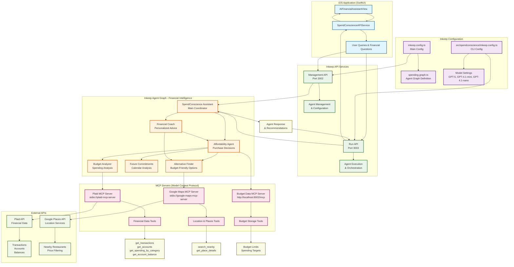

# Inkeep Integration Architecture - SpendConscience Project

This diagram illustrates the complete Inkeep integration architecture for the SpendConscience financial assistant application.

## Architecture Components

### 1. iOS Application Layer
- **AIFinancialAssistantView**: SwiftUI interface for user interactions
- **SpendConscienceAPIService**: Handles communication with Inkeep APIs
- **User Queries**: Natural language financial questions and requests

### 2. Inkeep Configuration
- **Main Config** (`inkeep.config.ts`): Defines tenant, API URLs, and agent graph
- **CLI Config** (`src/spendconscience/inkeep.config.ts`): Model settings and project configuration
- **Model Settings**: GPT-5 for base, GPT-4.1-mini for structured output, GPT-4.1-nano for summarization

### 3. Inkeep API Services
- **Management API** (Port 3002): Handles agent configuration and management
- **Run API** (Port 3003): Executes agent workflows and orchestrates responses

### 4. Agent Graph - Financial Intelligence System
- **SpendConscience Assistant**: Main coordinator that routes queries to specialist agents
- **Affordability Agent**: Makes purchase decisions based on real financial data
- **Budget Analyzer**: Analyzes spending patterns against budgets using Plaid data
- **Future Commitments**: Analyzes calendar events for upcoming expenses
- **Alternative Finder**: Finds budget-friendly alternatives when spending limits are reached
- **Financial Coach**: Provides personalized, actionable financial advice

### 5. MCP Servers (Model Context Protocol)
- **Plaid MCP Server**: Provides financial data access through standardized tools
- **Google Maps MCP Server**: Enables location-based restaurant and place searches
- **Budget Data MCP Server**: Manages user budget limits and spending targets

### 6. External APIs
- **Plaid API**: Real financial data including transactions, accounts, and balances
- **Google Places API**: Location services for finding nearby restaurants with price filtering

## Data Flow

1. **User Input**: User asks financial questions through iOS app
2. **API Routing**: Queries sent to Inkeep Run API for agent execution
3. **Agent Orchestration**: SpendConscience Assistant routes to appropriate specialist agents
4. **Data Retrieval**: Agents use MCP tools to fetch real financial and location data
5. **Analysis**: Multi-agent analysis combining budget, spending, and future commitments
6. **Response Generation**: Coordinated response with actionable recommendations
7. **UI Display**: Structured response displayed in iOS app with agent workflow visualization

## Key Features

- **Real-time Financial Data**: Direct integration with Plaid for actual transaction data
- **Multi-agent Intelligence**: Specialized agents for different aspects of financial analysis
- **Location-aware Recommendations**: Google Maps integration for budget-friendly alternatives
- **Calendar Integration**: Future expense prediction based on calendar events
- **Structured Responses**: Clear agent workflow and data source attribution
- **Model Optimization**: Different GPT models optimized for specific tasks

## Agent Trigger Conditions

- **Alternative Finder**: Activates when dining budget >90% used AND large dining expenses planned
- **Budget Analyzer**: Flags categories at >90% of monthly budget as "TRIGGER_ALTERNATIVES"
- **Affordability Agent**: Makes AFFORD/DON'T AFFORD/CAUTION decisions with numerical reasoning
